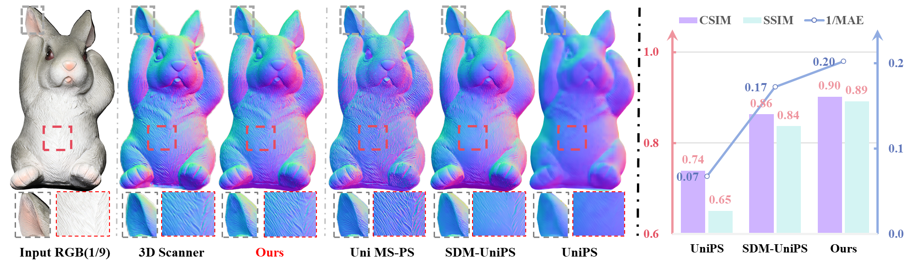
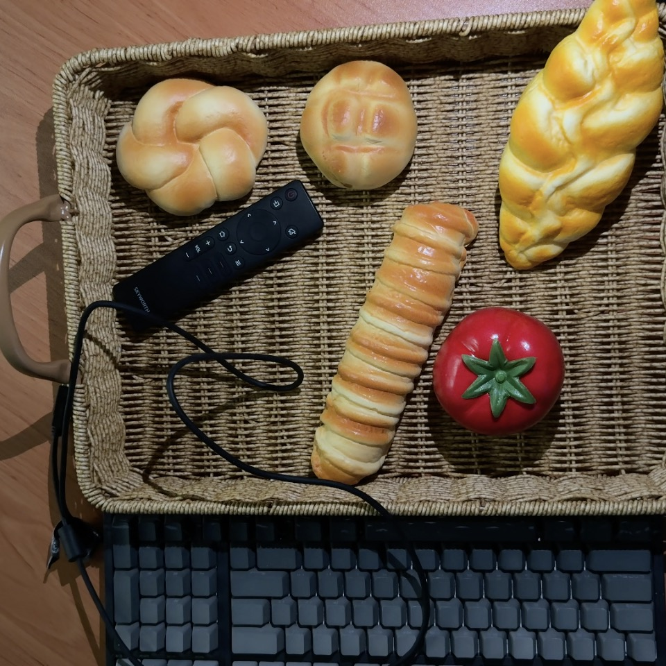
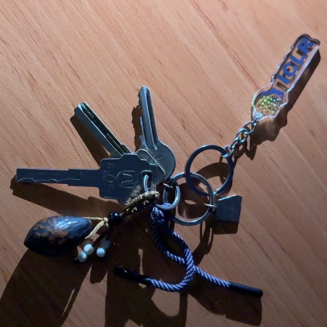
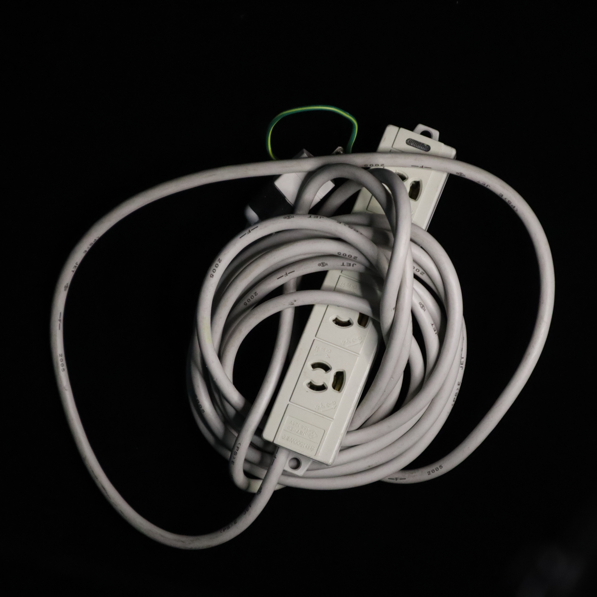
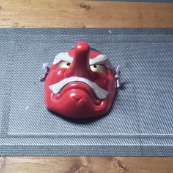
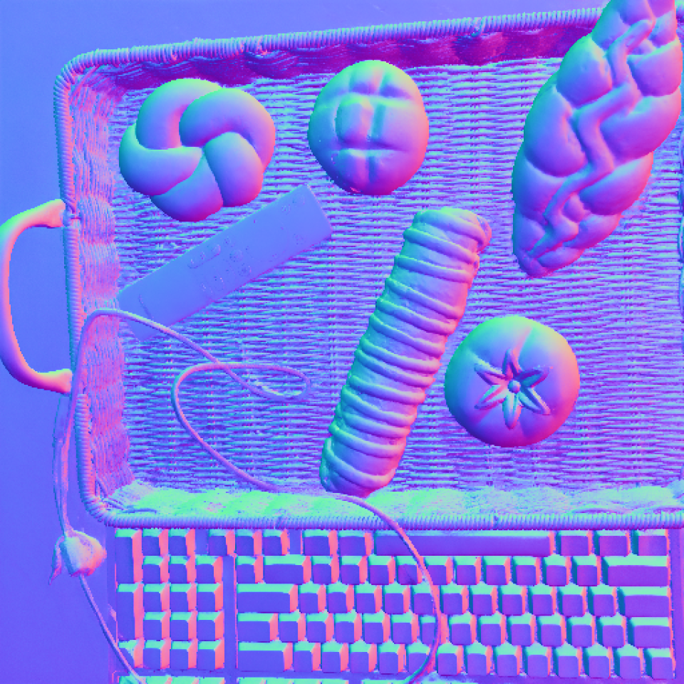
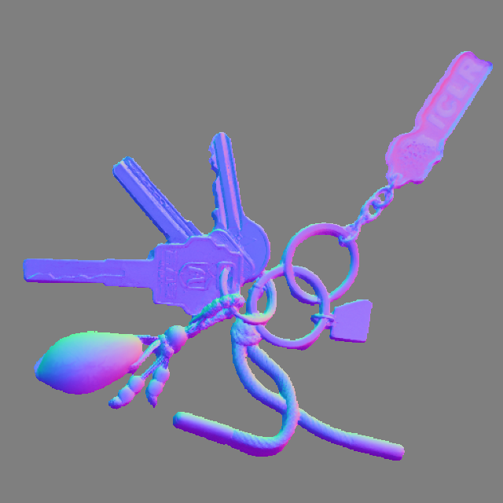
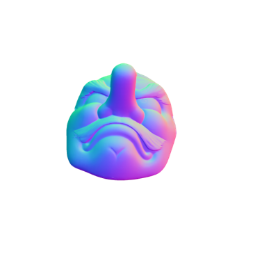
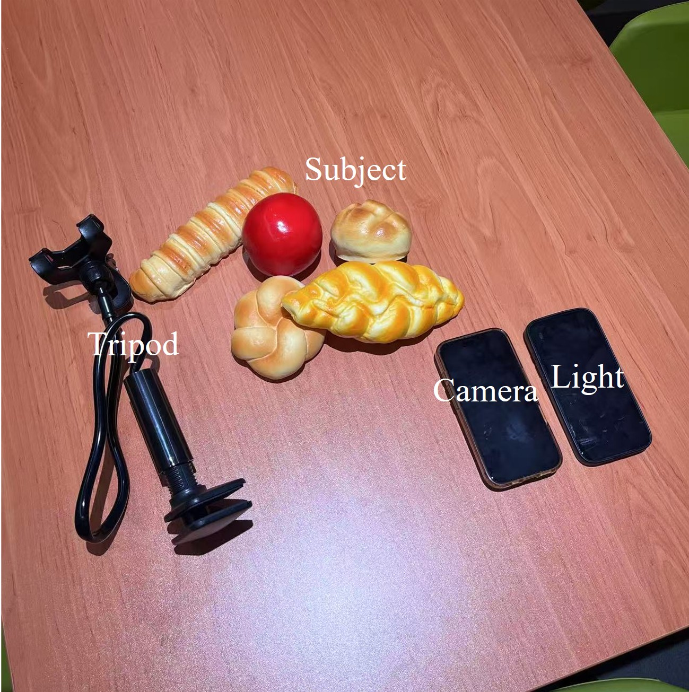
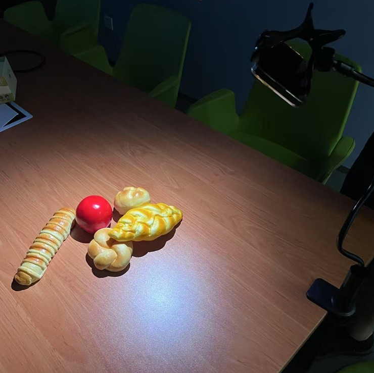

<div align="center">
<h1>Light of Normals: Unified Feature Representation for Universal Photometric Stereo</h1>

<a href="https://houyuanchen111.github.io/lino.github.io/"></a>
<a href="http://arxiv.org/abs/2503.14489"></a>
<a href="https://huggingface.co/houyuanchen/lino/tree/main"></a>
<a href="https://huggingface.co/spaces/houyuanchen/lino"></a>


Hong Li\*, Houyuan Chen\*
<br>
[Chongjie Ye](https://github.com/hugoycj), [Zhaoxi Chen](https://frozenburning.github.io/), Bohan Li, [Shaocong Xu](https://daniellli.github.io/),[Xianda Guo](https://xiandaguo.net/)
<br>
[Xuhui Liu](https://scholar.google.com.hk/citations?user=d4Dg1J4AAAAJ&hl=zh-CN), [Yikai Wang](https://scholar.google.com/citations?user=MnW5aegAAAAJ&hl=pl), [Baochang Zhang](https://scholar.google.com/citations?user=ImJz6MsAAAAJ&hl=zh-CN), [Satoshi Ikehata](https://satoshi-ikehata.github.io/), [Boxin Shi](https://scholar.google.com/citations?user=K1LjZxcAAAAJ&hl=en), [Anyi Rao](https://anyirao.com/), [Hao Zhao](https://scholar.google.com.hk/citations?user=ygQznUQAAAAJ&hl=en), 
<br>
<br>


</div>

<p align="center">
  
</p>


# 📊 Overview

`LiNo-UniPS` is a method for `Univeral Photometric Stereo (PS)`. It predicts the normal map from a given set of images. Key features include:
* **Light-Agnostic:** Does not require specific lighting parameters as input.
* **Arbitrary-Resolution:** Supports inputs of any resolution.
* **Mask-Free:** Also supports mask-free scene normal reconstruction.

# ✨ News

- June 2025 - Release paper, project page, Hugging Face demo and model checkpoint. 

# 🔛 Get Started 
### 💾 Installation

```bash
git clone https://github.com/houyuanchen111/lino.git
cd lino
conda create -n LiNo python=3.10
conda activate
pip install -r requirements.txt
```

### 🔧 Downloading Checkpoint
Run the script below to download the required model weights.

```bash
python cache_weight.py
```
This script downloads the pre-trained weights for both our LiNo-UniPS and [Hi3DGen](https://stable-x.github.io/Hi3DGen/) models. [Hi3DGen](https://stable-x.github.io/Hi3DGen/) is utilized as a downstream application of LiNo-UniPS.

### 📝 Dataset Preparation
Download the following benchmarks for evaluate our LiNO-UniPS.
* [DiLiGenT](https://drive.google.com/open?id=1EgC3x8daOWL4uQmc6c4nXVe4mdAMJVfg): A widely-used benchmark for photometric stereo, consisting of 10 real-world objects with diverse shapes and materials under precisely calibrated directional lighting.
* [LUCES](https://opendatalab.com/OpenDataLab/LUCES/cli/main): A challenging benchmark focused on complex material properties, captured under thousands of high-frequency lighting conditions from a screen-based setup.
* [DiLiGent10<sup>2</sup>](https://disk.pku.edu.cn/anyshare/zh-cn/link/AA2725831ED6D74D2396D8338CF434669D?_tb=none&expires_at=2035-04-14T14%3A43%3A48%2B08%3A00&item_type=file&password_required=false&title=DiLiGenT10%5E2_pmsData_release.zip&type=anonymous): The large-scale successor to DiLiGenT, featuring 100 real-world objects with more complex geometries and materials to better evaluate state-of-the-art methods.

After downloading, place them under `data/` as the folloing directory tree.
```bash
|-- data
	|-- DiLiGenT
		|-- ballPNG
		...
	|-- LUCES
		|-- BALL
		...
		
	|-- DiLiGenT_100
		|-- BALL_ABS
		...
```
### 🧑‍🏫 Evaluating on Benchmarks 
To evaluate the performance of LiNO-UniPS on the DiLiGenT, LUCES, and DiLiGenT10² benchmarks, run the corresponding scripts below.
```bash
# DiLiGenT
python eval.py --task_name DiLiGenT --data_root data/DiLiGenT/ --num_images 16 

# LUCES
python eval.py --task_name LUCES --data_root data/LUCES/ --num_images 16 

# DiLIGenT10²
python eval.py --task_name DiLiGenT_100 --data_root data/DiLiGenT_100/ --num_images 16
```
The evaluation results will be stored in the output directory.

Note for DiLiGenT10²: The ground truth normals for this benchmark are withheld for official evaluation. To get your score, you must submit the predicted results, which are saved in `.mat` format inside the `submit` directory, to the [official evaluation server](https://lab.ybh1998.space:8443/psbenchmarkwebsite/).


The performance of our released model exceeds the results originally reported in our paper. For this comparison, the results for all competing Universal PS methods ([UniPS](https://github.com/satoshi-ikehata/Universal-PS-CVPR2022), [SDM-UniPS](https://github.com/satoshi-ikehata/SDM-UniPS-CVPR2023), [Uni MS-PS](https://github.com/Clement-Hardy/Uni-MS-PS)) are the best scores as reported by the Uni MS-PS.

<table style="width: 100%; border: none;">
  <tr style="border: none;">
    <td style="vertical-align: top; width: 33.3%; border: none; padding: 0 10px 0 0;">
      <h4>Table 1: DiLiGenT.</h4>
      <table style="width: 100%;">
        <thead>
          <tr>
            <th>Method</th>
            <th>Average MAE↓</th>
          </tr>
        </thead>
        <tbody>
          <tr>
            <td>UniPS</td>
            <td>14.7</td>
          </tr>
		  <tr>
            <td>SDM-UniPS</td>
            <td>5.80</td>
          </tr>
		  <tr>
            <td>Uni MS-PS</td>
            <td>4.97</td>
          </tr>
		  <tr>
            <td>LiNo-UniPS (Paper)</td>
            <td>4.94</td>
          </tr>
		  <tr>
            <td>LiNo-UniPS (Release,K=96)</td>
            <td><strong>4.74</strong></td>
          </tr>
        </tbody>
      </table>
    </td>
    <td style="vertical-align: top; width: 33.3%; border: none; padding: 0 10px;">
      <h4>Table 2: LUCES.</h4>
      <table style="width: 100%;">
        <thead>
          <tr>
            <th>Method</th>
            <th>Average MAE↓</th>
          </tr>
        </thead>
        <tbody>
          <tr>
            <td>UniPS</td>
            <td>23.77</td>
          </tr>
		  <tr>
            <td>SDM-UniPS</td>
            <td>13.50</td>
          </tr>
		  <tr>
            <td>Uni MS-PS</td>
            <td>11.10</td>
          </tr>
		  <tr>
            <td>LiNo-UniPS (Paper)</td>
            <td>10.69</td>
          </tr>
		  <tr>
            <td>LiNo-UniPS (Release,K=32)</td>
            <td><strong>9.47</strong></td>
          </tr>
        </tbody>
      </table>
    </td>
    <td style="vertical-align: top; width: 33.3%; border: none; padding: 0 0 0 10px;">
      <h4>Table 3: DiLiGenT10².</h4>
      <table style="width: 100%;">
        <thead>
          <tr>
            <th>Method</th>
            <th>Average MAE↓</th>
          </tr>
        </thead>
        <tbody>
          <tr>
            <td>UniPS</td>
            <td>23.79</td>
          </tr>
		  <tr>
            <td>SDM-UniPS</td>
            <td>14.97</td>
          </tr>
		  <tr>
            <td>Uni MS-PS</td>
            <td>13.20</td>
          </tr>
		  <tr>
            <td>LiNo-UniPS (Paper)</td>
            <td>12.21</td>
          </tr>
		  <tr>
            <td>LiNo-UniPS (Release,K=32)</td>
     		<td><strong>10.84</strong></td>
          </tr>
        </tbody>
      </table>
    </td>
  </tr>
</table>

### 🧑🏼‍🏫 Evaluating on Real-World Data (In-the-Wild)

LiNo-UniPS also demonstrates robust performance on multi-light images captured in-the-wild. In the `data/Real_data/` directory, we provide two real-world scenes captured using a unique two-iPhone setup, where one device was used for recording and the other as a movable light source.

For more real-world data captured by camera, you can download from [UniPS](https://satoshi-ikehata.github.io/cvpr2022/univps_cvpr2022.html), [SDM-UniPS](https://www.dropbox.com/scl/fo/fln61xs3xkpeni0mjtzds/ABAhepegwuhB8XGgWf_j5GY?rlkey=558iqt936084b8higxtnyz225&e=1&dl=0). 

After downloading, please place the extracted folders under the `data/Real_data/` directory to match the following structure:

```bash
|-- data
	|-- Real_data
		A 
        ├── mask.png (optional)
        ├── [Prefix (default: "L")] imgfile1
        ├── [Prefix (default: "L")] imgfile2
        └── ...
        B 
        ├── mask.png (optional)
        ├── [Prefix (default: "L")] imgfile1
        ├── [Prefix (default: "L")] imgfile2
        └── ...
```

Then, run the following scripts:
```bash
# Real_data. If the value provided for --num_images exceeds the total number of available images, the maximum available number will be used instead.

python eval.py --task_name Real --data_root data/Real_data/ --num_images 12 
```
<table>
  <thead>
    <tr>
      <th colspan="2" style="text-align: center;">Captured by iPhone</th>
      <th colspan="2" style="text-align: center;">Captured by Camera (provided by  <a href="https://satoshi-ikehata.github.io/cvpr2022/univps_cvpr2022.html" target="_blank">UniPS</a>, 
  <a href="https://www.dropbox.com/scl/fo/fln61xs3xkpeni0mjtzds/ABAhepegwuhB8XGgWf_j5GY?rlkey=558iqt936084b8higxtnyz225&e=1&dl=0" target="_blank">SDM-UniPS</a>)</th>
    </tr>
  </thead>
  <tbody>
    <tr>
      <td style="text-align: center;"></td>
      <td style="text-align: center;"></td>
      <td style="text-align: center;"></td>
      <td style="text-align: center;"></td>
    </tr>
    <tr>
      <td style="text-align: center;"></td>
      <td style="text-align: center;"></td>
      <td style="text-align: center;"></td>
      <td style="text-align: center;"></td>
    </tr>
  </tbody>
</table>

### 🚀 Gradio demo

This gradio demo is a GUI interface that requires no expert knowledge, suitable for general users. Simply run:

```bash
python app.py
```
You can also use it online. Click [here](https://huggingface.co/spaces/houyuanchen/lino).


### 📱 'Photometric Stereo' Your Own Data

Here, we provide a simple way to capture multi-light images. 
#### Step 1. `Prepare`

What you need to prepare is:

* **Camera:** A smartphone camera is perfectly sufficient, though a dedicated digital camera will also work.
* **Tripod:** To hold your phone or camera steady and motionless.
* **Light:** Smartphone's flashlight is enough, others can also be used.
* **Subject:** The object or scene you want to 'Photometric Stereo'.
<p align="center">
  
</p>

#### Step 2. `Take Photos`
Keep the **camera** and the **subject** stationary. Capture multiple images by moving the light source to a different position for each shot. For best results, we recommend capturing 4 or more images.

<p align="center">
  
</p>

#### Step 3. `Process and Predict`
Organize your captured images into a new folder and place it inside the `data/Real_data/` directory. The images should be saved in `.jpg` or `.png` format. 
For example:

```bash
|-- data
	|-- Real_data
		Your_Object_Name 
        ├── mask.png (optional)
        ├── L_1.jpg
        ├── L_2.jpg
        └── ...
```
 `mask.png` is optional. If needed, it can be generated using [Konstantin Sofiiuk's software](https://github.com/SamsungLabs/ritm_interactive_segmentation).

# 🔖 Citing

If you find this repository useful, please consider giving a star :star: and citation.

```
@article{zhou2025stable,
    title={Stable Virtual Camera: Generative View Synthesis with Diffusion Models},
    author={Jensen (Jinghao) Zhou and Hang Gao and Vikram Voleti and Aaryaman Vasishta and Chun-Han Yao and Mark Boss and
    Philip Torr and Christian Rupprecht and Varun Jampani
    },
    journal={arXiv preprint arXiv:2503.14489},
    year={2025}
}
```